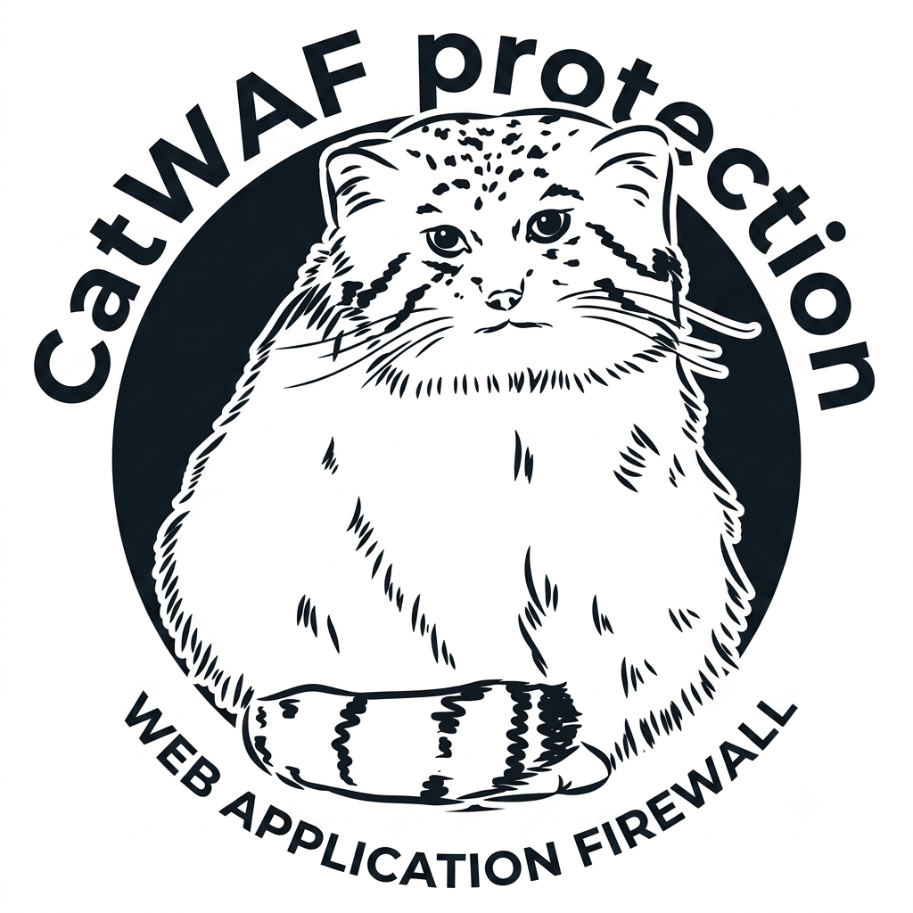
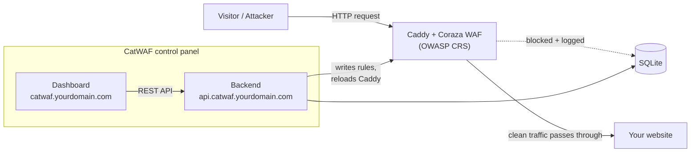

<div align="center">



# CatWAF Free

**A web application firewall for your website — powered by Coraza WAF + Caddy + the OWASP Core Rule Set.**

Built on a native Go WAF engine. Not a ModSecurity wrapper.

[](LICENSE)
[](https://nodejs.org)
[](CHANGELOG.md)

[Quick Start](#quick-start) • [Features](#whats-included) • [Docs](docs/) • [Contributing](CONTRIBUTING.md)

</div>

---

CatWAF sits in front of your website and inspects every request through Coraza — a native Go WAF engine running the OWASP Core Rule Set — then gives you a control panel for it. Turn protection on, tune how strict it is, block bad IPs and countries, and see what's actually hitting your site.

**CatWAF Free is the website-owner edition:** one site, one admin, no fleet management or SOC tooling. Everything here is meant to be usable without being a security engineer.

## Two editions

Pick one at install time. The WAF is identical in both — the edition decides what runs
*around* it.

|  | **Lite** | **Full** |
|---|:---:|:---:|
| Caddy + Coraza + OWASP CRS | ✓ | ✓ |
| `catwaf` CLI (every command) | ✓ | ✓ |
| SQLite event + request log | ✓ | ✓ |
| systemd service | ✓ | ✓ |
| HTTP API server | — | ✓ |
| Web dashboard | — | ✓ |
| Attack Map, Threats, Logs, Rules pages | — | ✓ |
| CatAI assistant (optional) | — | ✓ |
| `catwaf docker` stack commands | — | ✓ |
| Frontend dependencies installed | **none** | React + Vite |

**Lite is genuinely lite.** It installs no React, no Vite, no `frontend/node_modules`.
`catwaf start` brings up the WAF and does not launch an HTTP server, because Lite does not
have one. Everything you would do in the dashboard, you do with `catwaf audit`,
`catwaf explain`, `catwaf rules` and friends.

Switching later is one command and preserves everything — see
[Upgrading Lite → Full](#upgrading-lite--full).

## Quick Start

### On a server

Download the installer, read it, then run it:

```bash
curl -fsSLo setup.sh https://raw.githubusercontent.com/agugusgeyehe-dot/catwaf/main/setup.sh
less setup.sh
sudo bash setup.sh            # interactive: choose Lite or Full
```

Or pick the edition directly:

```bash
sudo bash setup.sh --lite
sudo bash setup.sh --full --domain example.com --admin-user admin
```

Non-interactive, for servers and CI. `--yes` suppresses prompts — it never skips
validation:

```bash
CATWAF_ADMIN_PASSWORD='...' sudo -E bash setup.sh --lite --yes \
  --domain example.com --admin-user admin
```

The installer detects Debian/Ubuntu, Fedora, RHEL/Rocky/Alma and Alpine; installs Node 22+
and Caddy-with-Coraza if they are missing; creates a dedicated non-root `catwaf` service
account; and is safe to re-run — an existing installation is updated in place.

> **On `curl … | sudo bash`.** It works, but it is not the recommendation. Piping into a
> root shell means trusting the server, the TLS chain and every future change to that file
> without ever seeing what runs. HTTPS protects the transport; it says nothing about the
> content. See [SECURITY.md](SECURITY.md#installer-trust-model).

For **Full** with a domain, point two DNS records at your server:

| Record | Purpose |
|---|---|
| `catwaf.yourdomain.com` | The dashboard you log into |
| `api.catwaf.yourdomain.com` | The API the dashboard talks to |

Caddy requests HTTPS certificates for both automatically. Lite needs neither record.

### On your own machine

```bash
git clone https://github.com/agugusgeyehe-dot/catwaf
cd catwaf

# Lite — WAF + CLI, no frontend dependencies at all
CATWAF_EDITION=lite npm install
catwaf setup --lite

# Full — adds the API and dashboard
CATWAF_EDITION=full npm install
npm run build
catwaf setup --full
```

`npm install` reads `CATWAF_EDITION` and installs frontend dependencies only for Full.
`sudo npm link` puts `catwaf` on your PATH; without it, run `node bin/catwaf.js` instead.

Leave the domain blank during setup to run locally — Full serves the dashboard at
**http://localhost:8000**.

There are no default accounts. Setup creates your admin login with a password you choose —
until then, there is nothing to log into.

### Upgrading Lite → Full

```bash
catwaf setup --full
```

This installs the frontend dependencies, builds the dashboard, enables the API service and
sets `CATWAF_EDITION=full`. It is safe to re-run and preserves your WAF configuration,
database, event history, rules, domain settings and admin accounts. `catwaf setup --lite`
converts back, removing the API service rather than leaving it to fail on boot.

Check what you are running at any time:

```bash
catwaf edition     # -> lite | full
catwaf status      # version, edition, and per-component health
```

### The CLI

```bash
# Investigate
catwaf audit                      # traffic + attack summary (--last 24h, --attack SQLi)
catwaf explain <event-id>         # why a request was blocked, with remediation
catwaf explain --last
catwaf simulate --url '<url>'     # what WOULD the WAF do? upstream never contacted
catwaf replay <event-id>          # is a historical attack still blocked?

# Tune
catwaf paranoia                   # show levels; `catwaf paranoia 3` to change
catwaf mode                       # normal | lockdown | learning | maintenance
catwaf rules list|search|show|enable|disable

# Operate
catwaf health [--watch]           # component health; exit 0/1/2
catwaf security-test              # assess CatWAF's own posture
catwaf diff                       # what changed since the last snapshot
catwaf config snapshot|snapshots|diff <id>|restore <id>

# Lifecycle
catwaf doctor status start stop restart logs provision uninstall
catwaf user list|add|remove|passwd|role
catwaf version | catwaf edition

# Docker stack                                              (Full only)
catwaf docker up|down|restart|status|ps|logs|build
```

Every command above works in **both editions** except `catwaf docker`, which needs the
Full stack. Run it on Lite and it says so and exits 5 — it does not fail with a stack
trace or quietly do nothing.

Every command has `catwaf help <command>`. Full reference: [docs/cli.md](docs/cli.md).

**Exit codes.** `0` success · `1` runtime failure · `2` invalid arguments · `3` missing
dependency · `4` permission denied · `5` wrong edition. `catwaf health` keeps its own
documented `0`/`1`/`2` for healthy/degraded/unhealthy.

### Understanding a block

```bash
$ catwaf audit --last 1h          # find the event
$ catwaf explain CuQuuFLaytNognWn
```

`explain` shows the matched CRS rules and their descriptions, the paranoia
level, anomaly score vs threshold, which part of the request actually matched,
and what to do about it — including the exact command to disable only the
decisive rule if it turns out to be a false positive.

Bodies, cookies and `Authorization` headers are never stored by CatWAF, and
sensitive-looking query parameters are redacted in output.

### Testing changes safely

```bash
catwaf simulate --url 'http://your.site/?id=1+UNION+SELECT+1--'
catwaf simulate --request ./request.txt
```

Simulation runs your **current** WAF configuration through a throwaway
Caddy + Coraza instance pointed at a local sink. Your real upstream is never
contacted, so nothing destructive can happen. It uses the real engine rather
than approximating it — if Caddy with Coraza is unavailable, it says so
instead of guessing.

`catwaf replay <event-id>` reconstructs a stored attack from sanitized fields
and runs it through the same sandbox, telling you whether your current
configuration would still block it — and warning loudly if it would not.

### Operating modes

| Mode | Blocks? | Use it for |
|---|---|---|
| `normal` | yes | Standard production protection |
| `lockdown` | yes, aggressively | An active incident. Paranoia 4, tighter threshold. Will cause false positives. |
| `learning` | **no** | Finding false positives before enforcing. Records everything, blocks nothing. |
| `maintenance` | yes | Planned work. Protection unchanged; audit logging reduced. |

`learning` deliberately leaves your site unprotected while active — CatWAF
warns you before switching and requires confirmation.

### Serving the dashboard at catwaf.yourdomain.com

CatWAF detects what is already running on the host — Caddy, nginx, Apache, or a control panel — and generates the right configuration:

```bash
catwaf provision                 # detect + print the config, change nothing
catwaf provision --apply         # install it, validate it, reload the server
```

`--apply` backs up the existing file first, validates the result, and **rolls back automatically if validation fails** — a broken config never goes live.

| Host | Behaviour | Verification status |
|---|---|---|
| Caddy | Automatic | Yes — config generation is covered by the WAF end-to-end suite, which runs real traffic through Caddy + Coraza. |
| nginx | Automatic (writes a site file, enables it, reloads) | **No.** The code path exists and is unit-tested against sample configs, but no live nginx host was tested. |
| Apache | Automatic (writes a vhost, reloads) | **No.** Same as nginx. |
| cPanel / Plesk / DirectAdmin | **Detected — manual configuration required.** CatWAF prints the config to use and does not touch panel-managed files. | **No.** Detection is unit-tested against sample layouts; no cPanel/WHM licence was available, so coexistence with a live panel is unverified. |

Control panels regenerate their own vhosts, so a file written underneath them would be overwritten — and editing them can break hosting for every account on the box. CatWAF will not do that automatically.

## What's included

**Protection** — Engine on / off / detection-only, Paranoia Levels 1–4, and per-category OWASP rules (SQL injection, XSS, PHP injection, path traversal, scanner detection, and more).

**Access control** — IP allow/block lists with expiry, country-level geo blocking, method allowlists, basic auth, client certificates, and a switch to refuse any request whose `Host` isn't one of yours — the mechanical fix for [origin exposure](docs/protection.md#why-a-feature-might-not-be-doing-anything).

**Client reputation** — The rule engine asks *is this request malicious?*; this layer asks *should this client be here at all?* A challenge gate (cookie, JavaScript proof-of-work, a self-hosted captcha, or reCAPTCHA/hCaptcha/Turnstile/mCaptcha), behavioural banning, ASN and forward-confirmed reverse-DNS rules, DNSBLs and subscribed community blocklists. Every feature that stops an address writes to [one ban store](docs/protection.md#active-bans), so "why is this visitor blocked" has a single answer. All of it is off by default. See [the protection guide](docs/protection.md).

**Configuration** — Around 300 settings across 40 groups — TLS and certificates, reverse-proxy behaviour, response headers, CORS, compression, caching, generated `robots.txt` and `security.txt` — reachable from the dashboard, `catwaf settings`, or the API, all through the same validation. Every change can be [previewed as a Caddyfile diff](docs/cli.md#catwaf-settings) before it applies, and is validated by Caddy and rolled back if it wouldn't load. See the [settings reference](docs/settings.md).

**Operations** — One scheduler for every timed task, backups, configuration templates, CSV and printable reports, a [Prometheus endpoint](docs/metrics.md), and two-factor admin login. `catwaf doctor` reports what the installed Caddy build can actually do, and names anything you've switched on that couldn't be rendered because of a missing module — so an enabled feature is never a silent no-op.

**Sensitive files** — Five graduated levels (SFL 0–4) that block access to config files, backups, and version-control directories, plus a scanner that walks your real webroot and shows what's publicly reachable.

**Upload scanning** *(optional)* — Files posted to the upload paths you nominate can be scanned by a local ClamAV daemon before they reach your origin. Off by default, and the only feature that puts CatWAF in the data path — for those paths alone. CatWAF neither bundles nor installs an AV engine; without a local `clamd` the feature reports itself unavailable rather than failing requests. See [the protection guide](docs/protection.md#upload-malware-scanning).

**Cloudflare** — A guided wizard to verify your zone, turn proxying on, enforce strict SSL, and lock your origin so traffic can't bypass Cloudflare.

**Visibility** *(Full)* — A dashboard of real traffic, a security score with specific recommendations, an origin exposure scanner, setup diagnostics, and alerts via Discord, Slack, Telegram, or a webhook.

**Attack Map** *(Full)* — A 2D map or 3D globe of where blocked requests actually came from, with per-location attack breakdowns and a live event feed. It is built from real GeoIP data attached to each blocked request at ingest. Requests whose source cannot be geolocated — private addresses, and anything the database has no entry for — are not plotted, and the map says it has no data rather than inventing points to fill space.

**Threats, Logs and Rules** *(Full)* — Severity-ranked threat activity, a searchable and filterable request log, and a browsable CRS rule index. All three are available in Lite through `catwaf audit`, `catwaf explain` and `catwaf rules`.

**CatAI** *(Full, optional)* — An optional local assistant (look for the cat, bottom-right of the dashboard). CatWAF Full runs perfectly well without it. Ask it how something works, ask what your setup looks like, or just tell it what you want done:

```
"block traffic from China"        → applies immediately, with an undo button
"set paranoia to 3"               → applies immediately, with an undo button
"add a rule blocking /xmlrpc.php" → writes a real Coraza rule into your Caddyfile
"am I protected right now?"       → reads your live config and tells you
"unblock Vietnam"                 → asks you to confirm first
```

Runs entirely on your machine via [Ollama](https://ollama.com) — nothing about your traffic or configuration leaves the box. Changes that *strengthen* protection apply immediately and can be undone in one click; anything that would *weaken* protection always asks first. Actions that could lock you out or turn protection off aren't available to it at all. See [the CatAI guide](docs/catai.md) for how it works and how to turn it on.

> Everything above reports on your actual system. When something isn't configured yet, CatWAF says so plainly instead of showing sample data.

## Prove it's working

Once CatWAF is in front of your app:

```bash
curl -o /dev/null -w '%{http_code}\n' "https://yoursite.com/?id=1+UNION+SELECT+1,2,3--"
# → 403

curl -o /dev/null -w '%{http_code}\n' "https://yoursite.com/?q=<script>alert(1)</script>"
# → 403

curl -o /dev/null -w '%{http_code}\n' -A "sqlmap/1.0" https://yoursite.com/
# → 403
```

Coraza refuses the request itself, so a CRS block is a bare `403` with an empty
body — deliberately, since an explanatory page tells an attacker what tripped.
The block is recorded either way: `catwaf explain --last` says exactly which
rules fired. (Requests stopped by the [sensitive-files
layer](docs/protection.md) are the exception — those answer
`You have been blocked by CatWAF`, unless a CRS rule recognised the path first
and got there before them.) Set a friendlier page for either with
`catwaf settings error_pages`.

### Run the whole demo locally

CatWAF ships a deliberately vulnerable app used **only** to demonstrate that the WAF blocks. It binds to loopback: public traffic reaches it on `:80` through Caddy + Coraza, and its own origin port `127.0.0.1:8082` is published for local inspection only.

```bash
cp .env.example .env      # then set JWT_SECRET — see the file for how
docker compose up --build

curl  "http://localhost/"                            # 200 - reaches the app
curl  "http://localhost/?id=1+UNION+SELECT+1,2,3--"  # 403 - blocked by Coraza
curl -A "sqlmap/1.0" "http://localhost/"             # 403 - blocked by Coraza

# The same app on its origin port, with no WAF in front of it — this is what
# an attacker who finds your origin gets, and what /origin-scanner checks for:
curl  "http://127.0.0.1:8082/?id=1+UNION+SELECT+1,2,3--"  # 200 - not inspected

# No accounts ship, here either. Create your login, then sign in:
docker compose exec backend node bin/catwaf.js user add admin --role admin
open http://localhost:8081                           # the event appears in the dashboard
```

Or without Docker, as an automated test that asserts every step:

```bash
npm run test:e2e
```

> The test app is intentionally vulnerable and clearly labelled as such. Never expose it. It exists so the block/allow behaviour above is demonstrable rather than asserted.

## Demo

<!-- docs/screenshots/demo.gif - see docs/screenshots/README.md for exactly what to record.
     No GIF is committed yet; nothing here is a mockup. -->

Screenshots and a demo GIF have not been captured for this release. [docs/screenshots/README.md](docs/screenshots/README.md) lists precisely what to capture and the commands that produce a real system to capture it from — deliberately, rather than shipping fabricated images.

## How it fits together



CatWAF writes real Coraza directives into your Caddyfile and reloads it — there's no separate WAF config to hand-edit.

## Security

CatWAF Free is an admin panel for a firewall, so it's built to be defensible:

- **No default credentials.** None ship, at all.
- **The API isn't at a fixed address.** Authenticated requests go through a rotating path segment, so the endpoint list isn't enumerable.
- **Every authenticated request is signed.** A stolen token alone isn't enough to make a request, and captured requests can't be replayed or modified.
- **No anonymous reads.** Unauthenticated probes get an indistinguishable decoy response rather than a map of what exists.
- **Tokens never travel in URLs.** Session tokens are accepted in the `Authorization` header only, so they cannot leak through access logs, `Referer` headers or browser history.
- **No Docker socket.** CatWAF never mounts `/var/run/docker.sock`. Caddy is reloaded through its own admin API or the local binary.
- **No fabricated data.** The Attack Map plots only requests whose source IP actually resolved to a location. Unresolvable and private addresses are stored as `NULL` and shown as "no data" rather than filled in with plausible-looking points.

The rotating path segment is obscurity, not a control — it raises the cost of untargeted
scanning and nothing more. Authentication, request signing and role checks are what
actually enforce access.

Full detail — secret handling, network exposure, the installer's trust model, GeoIP
licensing, and the current dependency-advisory assessment — is in
**[SECURITY.md](SECURITY.md)**.

## Diagnostics

```bash
catwaf doctor          # environment: is everything installed and wired up?
catwaf health          # runtime: is everything actually working right now?
catwaf security-test   # posture: is CatWAF itself deployed safely?
```

`doctor` and `health` answer different questions: doctor checks whether the
environment is set up correctly (installed, writable, valid), health checks
whether the running system is currently functioning (Caddy up, events
ingesting, WAF intercepting). `health --watch` refreshes continuously.

All three exit non-zero on problems, so they work in automation.

Read-only. Checks the OS, Node runtime, Caddy and the Coraza module, Caddyfile syntax and writability, the audit-log pipeline, the database and its schema, authentication, ports, other web servers, and control panels — then tells you exactly what to do about anything wrong. Exits `0` when healthy and non-zero otherwise, so it works in automation. `--json` for machine-readable output.

## Performance

CatWAF does not ship benchmark numbers, because it has not run a benchmark worth publishing.

CatWAF is a **management and deployment layer around Coraza** — it writes Coraza directives, reloads Caddy, ingests Coraza's audit log, and gives you a UI and CLI for it. Request filtering itself is done by Coraza inside Caddy.

In a default install CatWAF's backend is not in the request path at all. Two opt-in features change that, and both say so where you enable them:

- **Runtime enforcement** (the client-reputation layer) adds a `forward_auth` hop from Caddy into CatWAF for the *headers* of each request. It fails open — every error path answers allow.
- **Upload malware scanning** proxies the *body* of requests to the upload paths you nominate through CatWAF so they can be scanned. Only those paths; everything else still goes straight to the origin.

That means:

- Performance characteristics attributed to **Coraza** are Coraza's, and should not be presented as independently measured CatWAF performance.
- A **ModSecurity** comparison is only meaningful against a like-for-like configuration (same rule set, same paranoia level, same workload, same hardware).
- Any CatWAF-specific number would need to be reproduced under documented conditions — hardware, OS, versions, rule set, workload, concurrency, methodology — before it means anything.

No such benchmark has been run for this release, so no numbers are claimed here.

## Requirements

- **Node 22+** — CatWAF uses the built-in `node:sqlite`, which older versions don't have
- **Caddy with the Coraza module** — installed automatically by `npm install`, or [build it yourself](docs/installation.md)
- **Ollama** *(optional, Full only)* — only if you want CatAI. CatWAF Full works fine without it; setup says so explicitly rather than treating it as a failure.

**Platforms.** `setup.sh` detects Debian, Ubuntu, Fedora, RHEL/Rocky/AlmaLinux and Alpine.
On any other Linux distribution it stops with an explanation and manual instructions rather
than guessing. macOS is supported for manual installation
(`git clone && npm install && catwaf setup`) but not by the installer script.

Not every one of those has been run end to end. The table below records what was actually
exercised, and when. It is published so you can judge the risk yourself rather than take
"supported" on trust:

| Platform | Status |
|---|---|
| Debian 12 (bookworm) | **Verified in 1.0.2** — clean-OS Full install from `setup.sh`, idempotent re-run, the full test suite, CLI, dashboard, signed API, WAF blocking in front of a real application, ClamAV upload scanning. Tested in a container, so systemd service installation and reboot persistence were *not* covered. |
| Docker | **Verified in 1.0.2** — `docker compose up --build` from a clean checkout: dashboard, backend API, and the WAF blocking the documented attack requests against the bundled test app on first boot. |
| AlmaLinux 9 | **Verified in 1.0.1** — clean-OS Lite install, idempotent re-run, Lite → Full upgrade, CLI, edition gating; same container caveat. Not re-run for 1.0.2. |
| Ubuntu, Fedora, Rocky, Alpine | **Expected to work, not verified.** They share the apt/dnf/apk code paths that Debian and AlmaLinux exercised, but no run was performed. |
| macOS | **Not verified.** Manual installation only; the installer script refuses to run. |

Two things nothing above covers, on any platform: the systemd units are installed only when
an init system is present, and **reboot persistence has not been verified**. Both need a real
VM. See [`docs/installation.md`](docs/installation.md).

**Footprint.** The backend needs roughly 200 MB of RAM. CatAI adds about 1.4 GB while a
question is being answered. On disk, the bundled GeoIP database is about 150 MB and is the
largest single component of a Lite install — see
[SECURITY.md](SECURITY.md#geoip-data) for its licensing terms. A Full install adds roughly
500 MB of frontend build dependencies on top.

## Documentation

- [Installation](docs/installation.md) — full setup, editions, and building Caddy with Coraza
- [Security](SECURITY.md) — secrets, exposure, installer trust model, GeoIP licensing
- [Docker](docs/docker.md) — running the stack in containers, and `catwaf docker`
- [Reverse proxy setup](docs/reverse-proxy.md) — putting CatWAF in front of a real app
- [Cloudflare](docs/cloudflare.md) — the wizard and origin locking
- [Rules](docs/rules.md) — paranoia levels and rule categories
- [CLI reference](docs/cli.md) — every command, flag and exit code
- [Settings reference](docs/settings.md) — every setting, its type and its default
- [Protection layer](docs/protection.md) — bans, the challenge gate and threat intelligence
- [TLS and certificates](docs/tls.md) — certificate sources, ACME, wildcards, mTLS
- [Metrics](docs/metrics.md) — the Prometheus endpoint and what to alert on
- [Plugins](docs/plugins.md) — the data-only extension contract
- [CatAI](docs/catai.md) — the local assistant: setup, what it can do, and how it's kept safe
- [Architecture](docs/architecture.md) — how the code is organized, and the real request path
- [Screenshots](docs/screenshots/README.md) — what still needs capturing

## Contributing

Bug reports, feature requests, and security disclosures are welcome via issues — see [CONTRIBUTING.md](CONTRIBUTING.md). The project's license doesn't permit accepting code contributions right now. Run the test suites if you're reading the code:

```bash
npm test                # security, CatAI, platform, and the real WAF end-to-end test
npm run test:frontend   # browser smoke tests (needs a Chromium build)
```

The end-to-end suite starts a local-only vulnerable app behind real Caddy + Coraza, sends real attacks, and asserts they are blocked *and* recorded. It **skips rather than fakes** if Caddy with the Coraza module is not installed.

## License

CatWAF is source available under the [PolyForm Internal Use License 1.0.0](LICENSE), plus an additional permission for personal, noncommercial use by individuals.

Running CatWAF to protect your own websites and applications — including public-facing ones — is internal business use and is covered.

**Not covered:** redistributing CatWAF, or running it as a managed service on behalf of third parties. Contact agugusgeyehe@gmail.com for a commercial license.

"CatWAF" and its logo are trademarks, not covered by the software license — see [TRADEMARKS.md](TRADEMARKS.md).

See [CHANGELOG.md](CHANGELOG.md) for what's changed and [ROADMAP.md](ROADMAP.md) for what's next.
