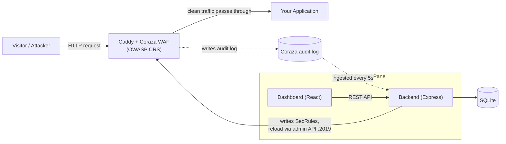

# Architecture

## Request flow

```
                        Internet
                           |
                           v
                    Caddy  (:80 / :443)
                           |
                           v
                    Coraza  (OWASP CRS)
                           |
                 +---------+---------+
                 |                   |
              BLOCK               ALLOW
                 |                   |
                 v                   v
        Coraza audit log      Your application
                 |                  (the origin -- :8082
                 |                   by convention; never
                 |                   exposed directly)
                 |
                 v  (ingested every 5s)
              CatWAF backend  ---->  SQLite
                 |
         +-------+--------+
         |                |
        CLI            Web UI
                          ^
                          |
        backend reloads Caddy over the
        admin API (:2019) -- no Docker socket
```



**Nothing in this diagram uses the Docker socket.** The backend reloads Caddy
either by invoking a local `caddy reload` (host installs) or by `POST /load`
against Caddy's admin API (containers). `backend/services/caddy.js` contains
no Docker calls, and `test/platform.test.js` asserts that.

Caddy does the actual request inspection via the Coraza module — **in a default install, CatWAF's backend never sits in the request path for your protected app.** If the control panel is down, your site keeps being protected.

Two opt-in features deliberately change that, and neither is on unless you turn it on:

| Feature | What enters the path | If CatWAF is down |
|---|---|---|
| Runtime enforcement (client reputation) | A `forward_auth` hop carrying request **headers** | Fails open — every error path answers allow |
| Upload malware scanning | The request **body**, for the nominated upload paths only | Governed by `upload_scan.fail_open`, on by default |

Both hops overwrite `X-Real-IP` / `X-CatWAF-Client-IP` with the real
connection address before proxying to the backend — those header names are
visitor-settable, and every ban, allowlist hit and challenge decision keys
off them. The backend deliberately does not read `X-Forwarded-For` on these
endpoints: its leftmost entry is attacker-chosen.

Everything else keeps going straight from Caddy to your origin.

What the backend does: serves the dashboard's API, persists WAF configuration, translates that configuration into real Coraza directives written into your Caddyfile, triggers a reload, and ingests Coraza's own audit log so the dashboard can show real traffic.

## Backend layout

```
backend/
  server.js          # bootstrap: express app, middleware, mount 12 routers, listen
  middleware/
    auth.js          # JWT verification, request signing, admin/viewer gate, user list
    dynamicPath.js   # the rotating /g/<segment>/ gate in front of authenticated routes
    requestLogger.js # structured access logging
    errorHandler.js  # single place errors become responses
  routes/            # one file per feature area — thin: parse request, call a service
  services/          # shared logic — this is where the actual behavior lives
  knowledge/         # CatAI's knowledge base (markdown + YAML frontmatter)
```

### Routes

`alerts` · `auth` · `caddy` · `catai` · `cloudflare` · `dashboard` · `health` · `network` · `scanner` · `security` · `sensitive` · `waf`

Routers are mounted at the app root, not under a shared `/api` prefix — each route defines its own full path. Authenticated paths sit behind the rotating gate segment (see `middleware/dynamicPath.js`), so the URL a browser calls is `/g/<segment>/api/...` rather than a fixed `/api/...`.

> If you add a dev-server proxy rule for the gate, anchor it (`'^/g/'`). A bare `'/g'` prefix also captures the app's own `/geo` route.

### Services

| File | Responsibility |
|---|---|
| `db.js` | The single SQLite connection (`node:sqlite`). Generic `getState`/`setState` key-value helpers on top of real tables. |
| `state.js` | In-memory WAF and rule-category state, loaded from and persisted to `db.js`. Everything reads and writes through this — see the file header for why it's a singleton object rather than destructured exports. |
| `caddy.js` | Turns WAF state into real Coraza `SecRule` directives, patches them into the Caddyfile between marker comments, and reloads Caddy. |
| `sensitive.js` | Same pattern as `caddy.js`, scoped to Sensitive File Protection levels. |
| `requestLog.js` | Ingests Coraza's own audit log into a real `request_log` table. Everything the dashboard shows about traffic comes from here. |
| `traffic.js` | Shapes `request_log` rows into the payloads the dashboard and API expect. |
| `securityScore.js` | Computes the graded checklist and its recommendations from live state. |
| `audit.js` | Audit log, config snapshots, node registry, false-positive queue. |
| `scanner.js` | Known offensive-tool User-Agent signatures, and the webroot exposure scanner. |
| `cloudflare.js` | Thin wrapper around the Cloudflare API. |
| `sanitize.js` | Input validation shared across routes — IP/CIDR parsing, country codes, and the containment maths behind the self-lockout guard. |
| `environment.js` | Read-only detection of the host: OS, runtime, container, init system, Caddy/nginx/Apache, cPanel/Plesk/DirectAdmin, ports, and any existing CatWAF install. Structured output consumed by `catwaf doctor` and `catwaf provision`. |
| `provision.js` | Generates (and optionally installs, with backup + validation + rollback) the web-server config that serves the dashboard at `catwaf.<domain>`. Control panels are detection-only. |
| `lint.js` | Read-only validation of WAF state and the on-disk Caddyfile. |
| `debugger.js` | Request-trace simulator mirroring how Coraza evaluates a request phase by phase. |
| `secrets.js` | Key derivation for request signing. |
| `logger.js` | Structured logging with per-subsystem children. |
| `env.js` | `.env` loading, in one place, so scripts and the server agree. |
| `configLock.js` | Cross-process mutex (lock file + revision CAS in SQLite) serializing every configuration writer; also owns atomic file replace. See [Configuration concurrency](#configuration-concurrency). |
| `counters.js` | In-memory runtime counters (canary hits, alert deliveries) flushed to SQLite on a schedule so crash loss is bounded. |
| `edgeBans.js` | Renders the newest active bans into the Caddyfile as a `remote_ip` + `abort` region. Content-hash short-circuit, allowlist conflicts excluded bidirectionally, failed reloads retried next tick. |
| `alertDispatch.js` | Delivers alerts (spikes, new bans, engine changes) to webhooks/Telegram with cross-process cooldowns and refund-on-total-failure. |
| `kernelBans.js` | Mirrors active bans into an nftables table for SYN-time drops. Heavily gated: setting + env + root + nft present + non-container. Manages only its own table. |
| `siemStream.js` | JSONL export of blocked requests to data/siem.jsonl with size rotation and exactly-once rowid cursor; optional HTTP collector POSTs. |
| `updateCheck.js` | Daily GitHub releases lookup for a newer CatWAF. Read-only, cached, prerelease-aware, "no releases yet" handled gracefully. |
| `configTx.js` | The atomic-change primitive every WAF mutation goes through: snapshot state, back up the Caddyfile, mutate, validate, render, `caddy validate`, reload — and roll back state *and* file on any failure. `rules`, `modes`, `paranoia` and snapshot `restore` all use it, so rollback behaviour is implemented once. |
| `rules.js` | CRS rule index. Discovers real CRS `.conf` files (env override, Go module cache, common system paths), parses id/msg/severity/paranoia-tag/targets, and falls back to rules observed in real traffic when no files are found. Also owns per-rule enable/disable. |
| `events.js` | `explain` and `replay`. Joins a stored event with rule metadata, picks the *decisive* rule, and reports the real matched variable. Redacts sensitive query keys. |
| `simulate.js` | Runs a request through a throwaway Caddy + Coraza instance against a local sink, using the current configuration. Never contacts the real upstream. Strips sensitive headers first. |
| `modes.js` | Operating modes (normal / lockdown / learning / maintenance) as named bundles of real WAF settings, applied through `configTx`. |
| `snapshots.js` | Snapshot create/list/view/diff/restore on top of the existing `audit.js` snapshot table, with secret redaction and a safety snapshot taken before every restore. |
| `healthcheck.js` | Runtime component health (healthy / degraded / unhealthy) with meaningful exit codes. |
| `securityTest.js` | CatWAF's own deployment-posture assessment, by severity. |

### CatAI services

`services/catai/` is deliberately self-contained — deleting the directory and the one `app.use` line in `server.js` removes the feature entirely.

| File | Responsibility |
|---|---|
| `retrieval.js` | Picks which knowledge document answers a question. Weighted term overlap with IDF over `backend/knowledge/*.md`. No embeddings, no vector store. |
| `extract.js` | Deterministic action extraction from the user's message — regex and a country table. Runs *before* the model and resolves the large majority of requests without it. |
| `actions.js` | The closed action catalog: parameter validators, direction policy (strengthen vs weaken), `apply()`, and `restore()`. |
| `queries.js` | Read-only lookups (status, score, traffic, block lists) resolved from real state so the model reads back true numbers rather than inventing them. |
| `context.js` | Builds the trusted configuration block and the sanitized, fenced untrusted log block. |
| `prompt.js` | Assembles the final prompt in a fixed, prefix-stable order. |
| `ollama.js` | The only file that talks to the model. Streaming generation, tool calling, concurrency gate, circuit breaker. |
| `undo.js` | Capped ring of reversible entries, persisted so it survives a restart. |

The security-relevant property: **`extract.js` and the tool-call pass read only the user's own typed message** — never a retrieved document, never a log line. See [docs/catai.md](catai.md).

### Why services instead of logic in routes

A route handler's job is: read the request, call a service function, shape the response. If you're writing an `if` statement that touches `state.WAF` or talks to Caddy from inside a route file, that logic almost certainly belongs in a service — it's very likely something another route needs too.

### Configuration concurrency

More than one process mutates configuration (API server, CLI, jobs). All writers
serialize through `services/configLock.js`: `configTx.apply()` holds it across
snapshot → mutate → persist → render → validate → reload, low-level Caddyfile patchers
take it around their read-modify-write, and every write lands via temp-file + rename.
State mutations that bypass configTx must use `state.updateWAF()`, which re-reads
committed state under the lock first and persists with a revision bump
(`waf__rev`) so other processes refresh instead of overwriting. New writers get both
behaviors for free by using these two entry points — do not write the Caddyfile or the
`waf` blob directly.

### Adding a new feature

1. Add or extend a service function in `services/` if there's real logic involved.
2. Add a route handler in the relevant `routes/*.js` that calls it.
3. If it's a new file, mount it in `server.js`: `app.use(require('./routes/yourfile'))`.

## Frontend layout

```
frontend/src/
  pages/             # one file per major section
  components/        # Sidebar, Header, WelcomeTour, shared UI primitives
  components/catai/  # the mascot dock, chat panel, action cards
  auth/              # login screen and auth context
  utils/api.js       # the signed-request client — every backend call goes through here
```

`utils/api.js` is the only place that knows about the gate segment and request signing. Adding a call means using its helpers, not `fetch` — a raw `fetch` to a `/api/...` path will not be authenticated.

The `WelcomeTour` navigates to each page it describes, so its `STEPS` array must stay in step with the `<Route>` list in `App.jsx`. An entry pointing at an unmounted route drops a first-time user on a blank screen.

The frontend talks to the backend purely over the REST API — there's no shared code between them, so they can be developed and deployed independently.

## Tests

```bash
npm test                # security + catai + platform + waf-e2e
npm run test:frontend   # browser smoke tests (needs a Chromium build)
```

| Suite | What it proves |
|---|---|
| `test/security.test.js` | Request signing end to end: gated requests, replay rejection, body/path tampering, gate rotation, clock skew, forged tokens. |
| `test/catai.test.js` | The deterministic half of CatAI, plus Caddyfile path detection and global-options handling. |
| `test/platform.test.js` | Environment detection, nginx/cPanel parsing, generated web-server configs, provisioning apply/rollback, the user lifecycle, and that no Docker socket dependency exists. |
| `test/waf-e2e.test.js` | The real chain: Caddy + Coraza block real attacks, allow real traffic, and the events land in CatWAF's database with the right action, rule IDs, severity and classification. Skips cleanly if Caddy+Coraza is absent. |
| `test/sfl-e2e.test.js` | Sensitive File Level protection against a real Caddy + test app: SFL1-4 each actually block real requests (`.env`, `.gitignore`, `.git/config`, `.htpasswd`, `id_rsa`, etc.), higher levels are a strict superset of lower ones (SFL2 ⊇ SFL1 ⊇ ...), and SFL4's generated Caddyfile stays valid (`caddy validate`). Skips cleanly if Caddy is absent. |
| `test/waftools.test.js` | Rule index and validation, enable/disable changing real config, automatic rollback on invalid config, Caddyfile site-block targeting, operating modes, paranoia levels writing real CRS directives, snapshots/diff/restore with secret redaction, explain, audit windows and filters, health, security self-test, and live Coraza simulation + replay regression detection. |
| `test/frontend-smoke.test.js` | A real browser logs in, loads the dashboard, walks ten routes, and confirms authorization is enforced server-side. Skips cleanly without a browser. |

The E2E and frontend suites **skip rather than fake** when their prerequisites
are missing — they never report success without having actually exercised the
real thing.

`security.test.js` covers the request-signing scheme end to end: gated requests, replay rejection, body and path tampering, gate rotation, clock skew, and forged tokens.

`catai.test.js` covers the deterministic half of CatAI — the half that must be correct regardless of how good the model is. It needs no Ollama and no network.


## How a configuration change is applied

Every WAF mutation — a paranoia change, a mode switch, a rule toggle, a
snapshot restore — goes through `services/configTx.js`:

```
   snapshot in-memory state
             |
   back up the Caddyfile  ------------------.
             |                              |
        mutate state                        |
             |                              |
     domain validation  --- fails --------->|
             |                              |
   persist + render Caddyfile               |  rollback:
             |                              |  restore state AND
        caddy validate  --- fails --------->|  restore the Caddyfile
             |                              |  byte-for-byte
        caddy reload    --- fails --------->'
             |
          audited
```

A failed change never activates: the previous configuration is restored and
the failure is reported with the phase it failed in. This is asserted by
tests, including one that feeds deliberately invalid config and checks the
Caddyfile is restored byte-for-byte.

## Simulation and replay

`simulate` and `replay` never touch your upstream or production traffic:

```
   request (from --url, a request file, or a stored event)
             |
      strip Authorization / Cookie / API-key headers
             |
   throwaway Caddy + Coraza  (current WAF config, random free ports)
             |
        local sink server  <-- the only thing "upstream" here
             |
   read the sandbox's own audit log -> matched rules, score, verdict
             |
        tear down the sandbox and delete its temp directory
```

`--url` is parsed for its method, path, query and headers — CatWAF does **not**
fetch it. That is deliberate: fetching an arbitrary user-supplied URL from the
server would be an SSRF primitive.
